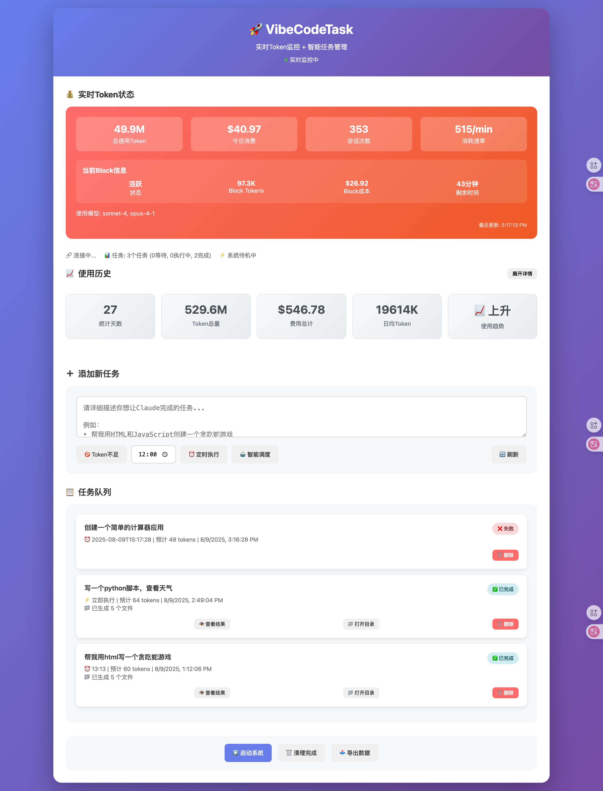
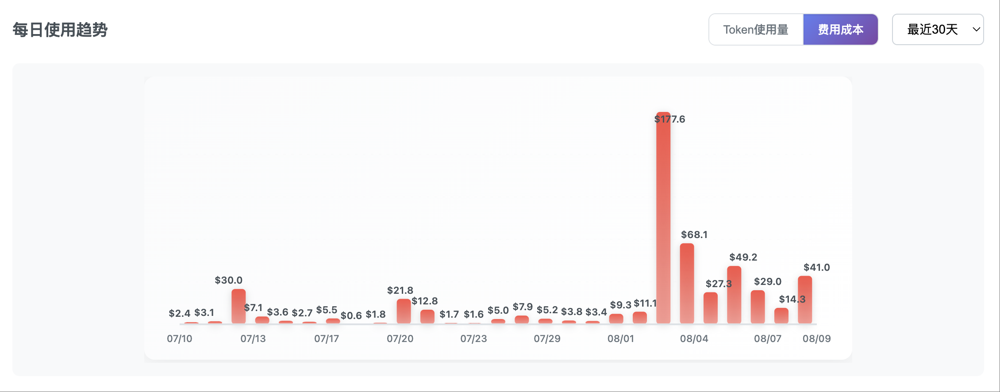
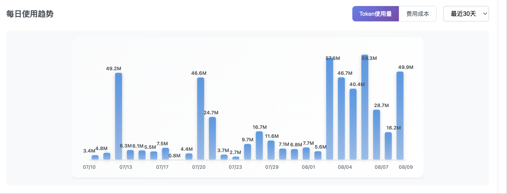

# VibeCodeTask - Claude Code 自动任务管理系统

## 🎯 项目背景

在使用 Claude Code 进行开发时，我们经常遇到以下问题：
- 晚上睡觉或离开电脑时，Claude Code 处于闲置状态，无法继续工作
- 无法批量安排任务，需要手动逐个下达指令
- 使用额度浪费，无法 24 小时高效利用 Claude Code

VibeCodeTask 是一个智能任务管理系统，通过自动化任务调度，让 Claude Code 能够 24 小时不间断工作，最大化利用您的订阅额度。

## ✨ 核心特性

- **📋 任务队列管理**：配置任务列表，设置优先级，自动排序执行
- **⏰ 智能调度**：基于 `ccusage blocks --live` 监控使用情况，智能分配任务
- **🤖 提示词优化**：自动拆解需求、生成技术方案、创建任务清单、逐项执行
- **📊 实时监控**：实时查看任务执行状态、Claude Code 使用情况
- **🔄 自动执行**：定时触发任务，无需人工干预
- **📝 任务追踪**：自动标记完成项，生成执行报告

## 🖥️ Web UI（全新）

项目内置 Web 界面，开箱即用：

```bash
python3 realtime_server.py
# 浏览器访问：http://localhost:8080
```

- 实时 Token 状态、使用历史、任务队列、执行结果一屏掌控
- 历史趋势图已从折线图升级为柱状图，支持悬浮提示与数值标签
- 支持「费用成本 / Token 使用量」快速切换与最近天数选择

示例截图（将图片放置到 `docs/images/` 目录后，以下链接将自动展示）：







## 🚀 快速开始

### 方式一：一键安装（推荐）

```bash
# 下载并运行安装脚本（支持 macOS/Linux）
curl -sSL https://raw.githubusercontent.com/yourusername/vibecodetask/main/install.sh | bash

# 或者使用 PowerShell（Windows）
iwr -useb https://raw.githubusercontent.com/yourusername/vibecodetask/main/install.ps1 | iex
```

### 方式二：单文件版本（极简）

```bash
# 下载 Python 单文件版本
curl -O https://raw.githubusercontent.com/yourusername/vibecodetask/main/vct.py

# 直接运行
python3 vct.py

# 检查使用情况
python3 vct.py --check
```

### 方式三：NPX 运行（无需安装）

```bash
# 直接运行，无需本地安装
npx vibecodetask

# 或者使用别名
npx vct --config my-tasks.json
```

### 方式四：完整安装

```bash
# 克隆项目
git clone https://github.com/yourusername/vibecodetask.git
cd vibecodetask

# 安装依赖
npm install

# 配置环境
cp .env.example .env

# ccusage 安装与回退机制（已集成）

- 安装依赖后会自动执行 `scripts/postinstall.js`：
  - 优先尝试全局安装 `npm install -g ccusage`
  - 如失败，自动回退为本地安装 `npm install ccusage --save`
- 后端 `realtime_server.py` 会优先使用系统的 `ccusage`，找不到则自动回退到项目内的 `node_modules/.bin/ccusage`
- 因此绝大多数情况下，你不需要手动安装 `ccusage`

# 安装为全局命令（可选）
npm install -g .
```

> 如果你想在 README 中显示上面的截图，请将你提供的三张图片保存为：
> - `docs/images/webui-overview.png`
> - `docs/images/webui-cost-bars.png`
> - `docs/images/webui-token-bars.png`
>
> 然后提交到仓库即可。

### 系统要求

- **Claude Code CLI**：必须已安装并配置（ccusage 将在安装后自动处理）
  ```bash
  # 检查是否已安装
  claude --version
  # ccusage 会在 npm install 后自动安装；如需验证：
  ccusage --version || ./node_modules/.bin/ccusage --version
  ```
- **Node.js 16+** 或 **Python 3.7+**
- **操作系统**：macOS、Linux、Windows（WSL）

## ⚙️ 配置任务

### 创建任务配置

使用以下命令快速创建任务配置：

```bash
# 生成默认配置文件
vct init

# 或手动创建 tasks.json
touch tasks.json
```

**tasks.json 示例**：

```json
{
  "tasks": [
    {
      "id": "task-001",
      "name": "重构用户认证模块",
      "priority": 1,
      "type": "development",
      "requirements": "将现有的用户认证模块从 JWT 迁移到 OAuth2.0，确保向后兼容",
      "estimatedTime": "2h",
      "schedule": "immediate",
      "dependencies": [],
      "context": {
        "files": ["src/auth/*.js"],
        "workspace": "./my-project"
      }
    },
    {
      "id": "task-002", 
      "name": "编写单元测试",
      "priority": 2,
      "type": "testing",
      "requirements": "为 API 接口编写完整的单元测试，覆盖率达到 80% 以上",
      "estimatedTime": "1h",
      "schedule": "after:task-001",
      "dependencies": ["task-001"],
      "context": {
        "testFramework": "jest",
        "files": ["src/api/*.js"]
      }
    },
    {
      "id": "task-003",
      "name": "生成 API 文档",
      "priority": 3,
      "type": "documentation",
      "requirements": "基于现有代码生成完整的 API 文档",
      "estimatedTime": "30m",
      "schedule": "daily:09:00",
      "retryCount": 3
    }
  ],
  "settings": {
    "maxConcurrent": 1,
    "checkInterval": 300000,
    "workHours": {
      "start": "09:00",
      "end": "18:00",
      "timezone": "Asia/Shanghai"
    },
    "notifications": {
      "onComplete": true,
      "onError": true,
      "webhook": "https://hooks.slack.com/your-webhook"
    }
  }
}
```

### 运行系统

```bash
# 方式1：一次性运行
vct run

# 方式2：守护进程模式
vct start --daemon

# 方式3：定时任务模式
vct schedule

# 方式4：交互模式
vct interactive
```

### 常用命令

```bash
# 查看状态
vct status

# 查看任务列表
vct list

# 添加任务
vct add "创建登录页面"

# 暂停/恢复
vct pause
vct resume

# 查看日志
vct logs

# 停止服务
vct stop
```

## 📁 项目结构

```
vibecodetask/
├── src/
│   ├── core/               # 核心模块
│   │   ├── scheduler.js    # 任务调度器
│   │   ├── executor.js     # 任务执行器
│   │   └── monitor.js      # 使用情况监控
│   ├── prompt/             # 提示词优化
│   │   ├── analyzer.js     # 需求分析器
│   │   ├── planner.js      # 方案规划器
│   │   └── optimizer.js    # 提示词优化器
│   ├── config/             # 配置管理
│   │   ├── tasks.js        # 任务配置
│   │   └── settings.js     # 系统设置
│   └── utils/              # 工具函数
├── config/                 # 配置文件
│   ├── tasks.json          # 任务列表
│   └── settings.json       # 系统配置
├── logs/                   # 日志文件
├── tests/                  # 测试文件
└── docs/                   # 文档
```

## 🔧 配置说明

### 系统配置 (settings.json)

```json
{
  "claude": {
    "checkInterval": 300000,     // 使用情况检查间隔（毫秒）
    "maxConcurrent": 1,           // 最大并发任务数
    "autoRetry": true,            // 失败自动重试
    "retryLimit": 3               // 重试次数限制
  },
  "scheduler": {
    "mode": "intelligent",        // 调度模式：intelligent/sequential/manual
    "workHours": {
      "start": "00:00",          // 工作开始时间
      "end": "23:59"             // 工作结束时间
    }
  },
  "prompt": {
    "optimization": true,         // 启用提示词优化
    "splitStrategy": "auto"       // 任务拆分策略
  }
}
```

### 任务配置字段说明

| 字段 | 类型 | 说明 |
|------|------|------|
| id | string | 任务唯一标识 |
| name | string | 任务名称 |
| priority | number | 优先级（1-10，数字越小优先级越高） |
| type | string | 任务类型：development/testing/documentation/refactoring |
| requirements | string | 详细需求描述 |
| estimatedTime | string | 预估时间 |
| schedule | string | 调度策略：immediate/after:task-id/at:time |
| dependencies | array | 依赖的任务 ID 列表 |

## 🎯 工作原理

1. **任务解析**：系统读取任务配置，根据优先级和依赖关系构建执行队列
2. **额度监控**：通过 `ccusage blocks --live` 实时监控 Claude Code 使用情况
3. **智能调度**：根据剩余额度、任务优先级、预估时间智能分配任务
4. **提示词优化**：
   - 自动分析需求，提取关键信息
   - 生成结构化技术方案
   - 创建细粒度任务清单
   - 优化提示词以提高执行效率
5. **任务执行**：调用 Claude Code CLI 执行任务，实时记录进度
6. **状态追踪**：自动标记完成项，生成执行报告

## 📈 使用场景

### 个人开发者
- **夜间开发**：睡前配置任务，醒来查看完成结果
- **学习项目**：自动生成练习代码和教程
- **代码重构**：批量优化和改进现有代码

### 团队协作
- **批量重构**：安排大规模代码重构任务，自动执行
- **测试编写**：批量生成单元测试、集成测试
- **文档生成**：自动生成 API 文档、使用说明
- **代码审查**：批量审查代码，生成改进建议

### 实际案例

```bash
# 案例1：夜间批量处理
vct add "重构所有 React 组件使用 hooks"
vct add "为所有 API 接口添加错误处理"
vct add "优化数据库查询性能"
vct schedule --start "22:00"

# 案例2：项目初始化
vct add "创建 Express + TypeScript 项目结构"
vct add "配置 ESLint 和 Prettier"
vct add "设置 Jest 测试环境"
vct add "创建 Docker 配置"
vct run --sequential

# 案例3：学习新技术
vct add "创建 Next.js 博客网站"
vct add "添加 Tailwind CSS 样式"
vct add "集成 Prisma 数据库"
vct add "部署到 Vercel"
```

## 🛠️ 开发路线图

### ✅ 已完成功能
- [x] 核心任务管理功能
- [x] Claude Code 集成
- [x] 基础调度器
- [x] 提示词优化
- [x] 单文件部署方案
- [x] 跨平台支持

### ✅ 已完成功能
- [x] Web 管理界面
- [x] 实时任务监控
- [x] 任务模板系统
- [x] 高级调度策略

### 📋 规划中（v1.2）
- [] 任务历史和统计
- [] 执行报告生成
- [] Webhook 通知
- [] 多项目支持

### 🔮 未来版本（v2.0+）
- [ ] Gemini CLI 支持
- [ ] 多 AI 协作模式
- [ ] 任务市场
- [ ] 团队协作功能
- [ ] 云端任务同步

## 🤝 贡献指南

欢迎参与项目贡献！

### 如何贡献

1. **Fork 项目**并创建功能分支
2. **提交代码**并确保通过所有测试
3. **创建 PR** 并详细描述改动

```bash
# 克隆你的 fork
git clone https://github.com/yourusername/vibecodetask.git
cd vibecodetask

# 创建功能分支
git checkout -b feature/awesome-feature

# 安装依赖并开发
npm install
npm run dev

# 运行测试
npm test

# 提交代码
git commit -m "Add awesome feature"
git push origin feature/awesome-feature
```

### 开发环境设置

```bash
# 安装开发依赖
npm install

# 启动开发模式
npm run dev

# 运行测试
npm test

# 代码检查
npm run lint

# 构建项目
npm run build
```

## 🐛 问题反馈

### 常见问题

**Q: Claude Code 命令未找到**
```bash
# 检查 Claude Code 是否已安装
which claude
# 如果没有，请访问 https://claude.ai/code 安装
```

**Q: 权限不足错误**
```bash
# 确保有执行权限
chmod +x vct.py
# 或者使用 python3 vct.py
```

**Q: 任务执行超时**
```bash
# 增加超时时间配置
vct config set timeout 300000  # 5分钟
```

### 提交 Issue

遇到问题请通过 [GitHub Issues](https://github.com/yourusername/vibecodetask/issues) 反馈，包含：

- 操作系统和版本
- Claude Code CLI 版本
- 错误信息和日志
- 复现步骤

## 📝 许可证

MIT License

## 🤝 贡献

欢迎提交 Issue 和 Pull Request！

## 📧 联系方式

如有问题或建议，请提交 Issue 或联系维护者。